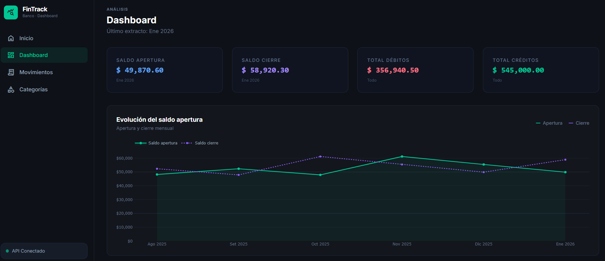

# Financial Tracker



Dashboard web para visualizar y analizar movimientos bancarios a partir de extractos en PDF o Excel. Permite categorizar transacciones, ver métricas financieras y generar gráficos interactivos.

## Arquitectura

```
┌─────────────────┐     HTTP      ┌──────────────────┐     SQL     ┌──────────────┐
│  Flask (puerto  │ ────────────► │  FastAPI (puerto │ ──────────► │  PostgreSQL  │
│     5000)       │               │     8000)        │             │  (puerto     │
│  Frontend web   │               │  REST API        │             │   5432)      │
└─────────────────┘               └──────────────────┘             └──────────────┘
```

| Servicio     | Tecnología          | Rol                                      |
|--------------|---------------------|------------------------------------------|
| `flask_app`  | Flask + Plotly      | Interfaz web, gráficos, upload de archivos |
| `api`        | FastAPI + SQLAlchemy| REST API, parseo de PDF/Excel            |
| `db`         | PostgreSQL 16       | Persistencia de datos                    |

## Funcionalidades

- **Carga de extractos**: sube PDFs o archivos Excel/XLS con tus movimientos bancarios
- **Dashboard**: gráficos de evolución de saldo, desglose por categoría, heatmap semanal y proyección de cierre de mes
- **Movimientos**: listado paginado con búsqueda, notas por transacción y exportación a CSV/XLSX
- **Categorías**: crea categorías con colores y asigna referencias de descripción para clasificación automática

## Requisitos

- [Docker](https://www.docker.com/) y Docker Compose

## Inicio rápido

1. Clona el repositorio:
   ```bash
   git clone https://github.com/Riccino22/finance-tracker.git
   cd dashboard_banco
   ```

2. Copia el archivo de variables de entorno:
   ```bash
   cp .env.example .env
   ```

3. Levanta los servicios:
   ```bash
   docker compose up --build
   ```

4. Abre el navegador en [http://localhost:5000](http://localhost:5000)

La API con documentación interactiva (Swagger) estará disponible en [http://localhost:8000/docs](http://localhost:8000/docs).

## Variables de entorno

El archivo `.env.example` contiene los valores por defecto:

| Variable            | Descripción                         | Default          |
|---------------------|-------------------------------------|------------------|
| `POSTGRES_DB`       | Nombre de la base de datos          | `banking`        |
| `POSTGRES_USER`     | Usuario de PostgreSQL               | `banking_user`   |
| `POSTGRES_PASSWORD` | Contraseña de PostgreSQL            | `banking_pass`   |
| `DATABASE_URL`      | URL de conexión (usada por la API)  | *(derivada)*     |
| `API_URL`           | URL de la API (usada por Flask)     | `http://api:8000`|

## Estructura del proyecto

```
dashboard_banco/
├── api/                  # Backend FastAPI
│   ├── main.py           # Punto de entrada, migraciones
│   ├── models.py         # Modelos SQLAlchemy
│   ├── schemas.py        # Esquemas Pydantic
│   ├── database.py       # Conexión a la base de datos
│   ├── pdf_parser.py     # Parseo de extractos PDF
│   ├── excel_parser.py   # Parseo de extractos Excel/XLS
│   ├── routers/          # Endpoints por recurso
│   │   ├── statements.py
│   │   ├── transactions.py
│   │   ├── categories.py
│   │   └── analytics.py
│   └── requirements.txt
├── flask_app/            # Frontend Flask
│   ├── app.py            # Rutas y lógica de presentación
│   ├── utils/api_client.py # Cliente HTTP hacia la API
│   └── templates/        # HTML (Jinja2)
├── db/
│   ├── init.sql          # Schema inicial
│   └── seed.sql          # Datos de ejemplo
├── mcp/                  # Servidor MCP (opcional, ver abajo)
│   └── server.py
├── docker-compose.yml
└── .env.example
```

---

## (Opcional) Servidor MCP para Claude Desktop

El directorio `mcp/` contiene un servidor [MCP](https://modelcontextprotocol.io/) que permite hacer preguntas conversacionales sobre tus movimientos bancarios directamente desde **Claude Desktop**.

### Cómo habilitarlo (modo stdio — recomendado para uso local)

1. Instala las dependencias del servidor:
   ```bash
   cd mcp
   pip install mcp httpx
   ```

2. Configura Claude Desktop en `~/.config/claude/claude_desktop_config.json`:
   ```json
   {
     "mcpServers": {
       "banco-dashboard": {
         "command": "python",
         "args": ["C:/ruta/al/proyecto/mcp/server.py"],
         "env": {
           "MCP_TRANSPORT": "stdio",
           "API_URL": "http://localhost:8000"
         }
       }
     }
   }
   ```

3. Reinicia Claude Desktop. Ahora podrás preguntarle cosas como:
   - *"¿Cuánto gasté en supermercado este mes?"*
   - *"¿Cuál fue mi saldo promedio en el último trimestre?"*

> **Nota:** Este paso es completamente opcional. El dashboard funciona de forma independiente sin el servidor MCP.

### Levantar el servidor MCP manualmente (modo SSE)

Si preferís no depender de Claude Desktop para lanzar el proceso, podés correr el servidor manualmente:

```bash
cd mcp
pip install mcp httpx
MCP_TRANSPORT=sse API_URL=http://localhost:8000 python server.py
```

El servidor quedará escuchando en `http://localhost:8002/sse`. Luego configurá Claude Desktop con:

```json
{
  "mcpServers": {
    "banco-dashboard": {
      "transport": "sse",
      "url": "http://localhost:8002/sse"
    }
  }
}
```

> **Importante:** con este modo el servidor debe estar corriendo antes de abrir Claude Desktop, y hay que levantarlo manualmente cada vez. Por eso se recomienda el modo stdio para uso local.
